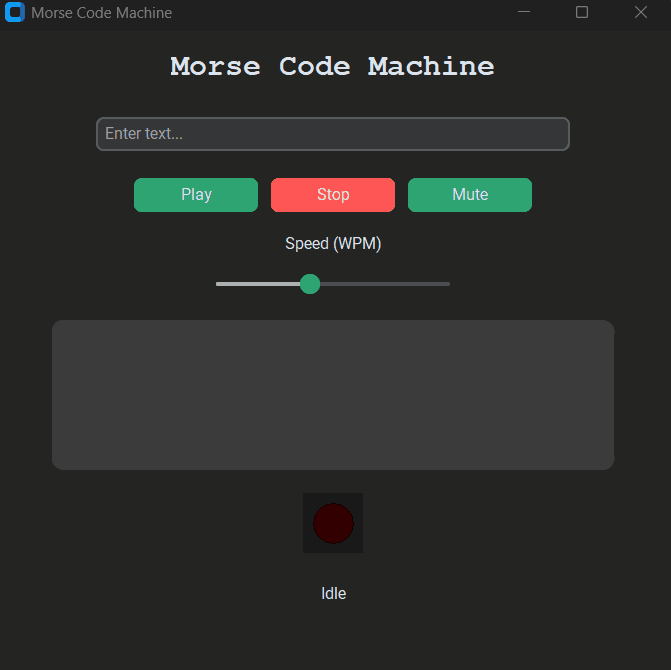
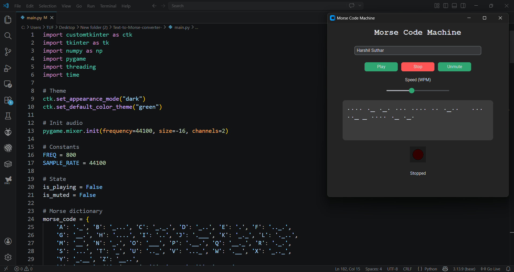

Ah, good catch! I'll add that documentation badge right at the top under the main header. Since you're adding the badge, I've also added a quick `## 📚 Documentation` section to the README so users know where to look.

Here is the updated version:

***

```markdown
# 🔠 Morse Code Machine

[](docs/documentation.md)

A modern **Text → Morse Code converter** with sound, visual feedback, and a clean UI. 
This application lets you convert text into Morse code, play it with realistic timing, and visualize the signal using an LED-style indicator—all in a smooth desktop interface.

## 🎥 Demo


## 🖥️ Preview


## ✨ Features
* **🔤 Instant Conversion:** Convert text to Morse code instantly.
* **🔊 Realistic Audio:** Real-time audio playback using accurate dot/dash tones.
* **🔴 Visual Feedback:** LED indicator synced perfectly with the Morse signals.
* **🎚️ Adjustable Speed:** Control the playback speed (Words Per Minute / WPM).
* **🔇 Audio Control:** Easily mute or unmute the playback.
* **📋 Exportable Output:** Large, copyable text box for the generated Morse code.
* **🎨 Modern UI:** A sleek, dark-mode friendly interface built with `customtkinter`.

## 📚 Documentation
For a deep dive into how the timing, audio generation, and UI are handled under the hood, check out the **[Technical Documentation](docs/documentation.md)**.

## 🚀 Installation

### 1. Clone the repository
```bash
git clone [https://github.com/harris8099/Text-to-Morse-converter-.git](https://github.com/harris8099/Text-to-Morse-converter-.git)
cd Text-to-Morse-converter-
```

### 2. Install dependencies
```bash
pip install -r requirements.txt
```
*(If you are setting this up manually without the requirements file, run: `pip install numpy pygame customtkinter`)*

## ▶️ Run the Application
```bash
python main.py
```

## 🧠 How It Works
* Text is converted into Morse using a standard dictionary mapping.
* Morse timing follows international standards:
  * **Dot:** 1 unit
  * **Dash:** 3 units
  * **Letter gap:** 3 units
  * **Word gap:** 7 units
* Audio frequencies are generated dynamically using `numpy` and `pygame`.
* The visual UI LED blinks precisely in sync with the audio signal.

## 📂 Project Structure
```text
├── main.py              # Main application script
├── requirements.txt     # Python dependencies
├── image.png            # UI Screenshot
├── docs/
│   └── documentation.md # Technical documentation
├── assets/
│   └── demo.gif         # Demonstration GIF
└── README.md            # Project documentation
```

## 🛠️ Tech Stack
* **Python** 🐍
* **customtkinter** 🎨 (For the modern graphical interface)
* **pygame** 🔊 (For audio playback and timing)
* **numpy** 📊 (For generating audio sine waves)

## 🤝 Contributing
Contributions are always welcome! If you’d like to improve the UI, add decoding features, or optimize the code:
1. Fork the repo
2. Create a new feature branch (`git checkout -b feature/AmazingFeature`)
3. Commit your changes (`git commit -m 'Add some AmazingFeature'`)
4. Push to the branch (`git push origin feature/AmazingFeature`)
5. Submit a Pull Request

## 💡 Future Improvements
* ⌨️ **Live key input:** Real-time Morse typing.
* 📥 **Decoder:** Morse → Text translation.
* 💾 **Audio Export:** Save the generated Morse code as a `.wav` file.
* 🎛️ **Advanced UI:** Add visual signal meters and tuning knobs.
* 🔌 **Hardware Integration:** Connect with an ESP32 or Arduino.

## 📜 License
This project is open-source and available under the [MIT License](LICENSE).

## 🙌 Acknowledgements
Inspired by classic Morse communication systems and modern UI design principles.
```
